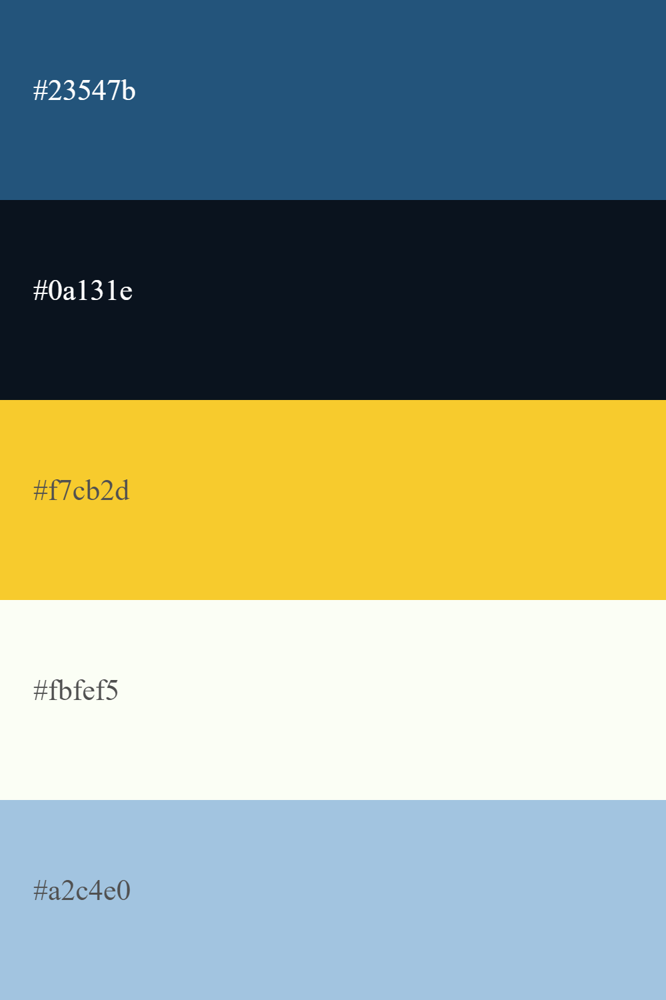

#Brewery Design e-commerce
**Esta es una pagina la cual sera integrada y donde confluiran entre si varios productos destinados al armado de un Bar**
Se hara incapie en la comercializacion de equipos ceveros y camaras frigorificas, pero tambien contara con un apartado donde se ofreceran otros productos:
-Alquieres de Choperas para Eventos privados
-Venta de mobiliario para bar:
 *Mesas
 *Sillas
 *Banquetas
 *Barras
-Venta de equipamiento gatronomico
 *Hornos
 *Anafes
 *Heladeras
 *Mesas de trabajo
 *Repisas/Bachas
-Comercilizacion de Cerveza en Barril (de marcas diferentes)

*Tambien se ofreceran servicios de mantenimiento para equipos de cerveza y equipos de refrigeracion y restrucuracion de equipos mal instalados*

**__Publico__**
Esta pagina esta orientada para un publico especifico, no cuenta con un limite de edad pero esta desterminado a que sea aquiel publico que desee comprar equipamiento para un bar, productos como bebidas ya sea para un negocio o para una fiesta particular.

**Tipografia**
La fuente a utilizar en la pagina principal es *ULTRA* (https://fonts.google.com/specimen/Ultra?preview.text=BREWERY&preview.text_type=custom#standard-styles), para los menus de header y las lestras de interaccion en el main, y cada seccion del e-commerce tendra otra fuente. En la parte de equipos de cerveza, comercilizacion de cerveza en barril y alquileres de equipos se mantendra la misma fuente. En la seccion de camaras, mobiliario y comercilizacion de insumos gastronomicos la fuente a usar sera *ACTOR* (https://fonts.google.com/specimen/Actor?query=old&preview.text=M&preview.text_type=custom#standard-styles).
Para el footer en toda la pagina se utilizara es *UBUNTU* (https://fonts.google.com/specimen/Ubuntu?preview.text=BREWERY&preview.text_type=custom)

**Paleta de Colores**
La paleta de colores a utilizar para el armado de la pagina:

**__Logo__**
Para el logo se utlizara la siguiente imagen
.png)